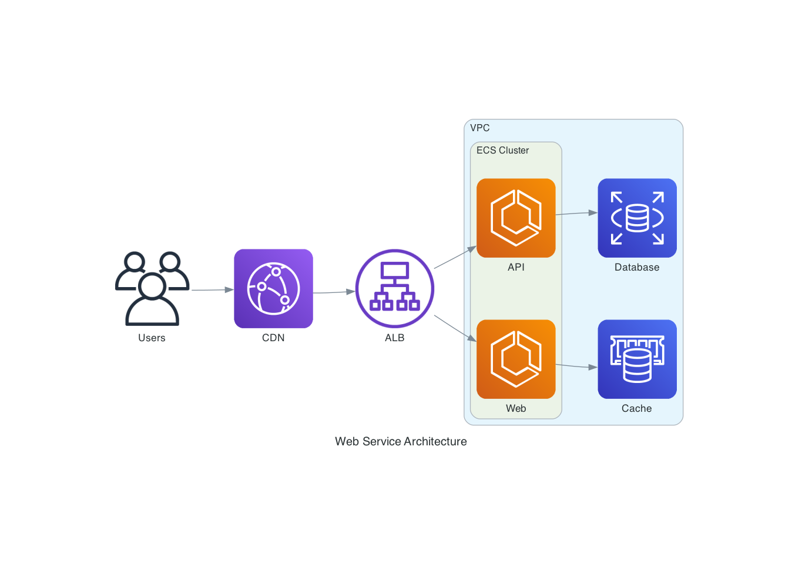
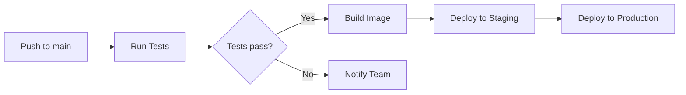
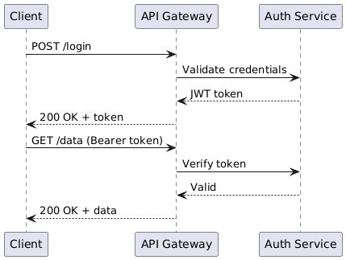
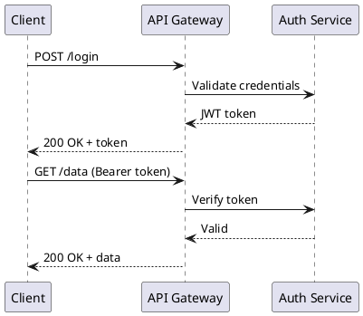

# diagrams-mcp-server

[](https://pypi.org/project/diagrams-mcp-server/)

MCP server for generating cloud architecture diagrams, flowcharts, sequence diagrams, and more — powered by three rendering engines: [mingrammer/diagrams](https://github.com/mingrammer/diagrams), [Mermaid](https://mermaid.js.org/), and [PlantUML](https://plantuml.com/).



## Getting Started

### Hosted (Recommended)

Connect to the public hosted server — no installation required. All rendering engines and dependencies are pre-installed.

Add to your MCP client configuration:

```json
{
  "mcpServers": {
    "diagrams-mcp": {
      "url": "https://diagrams-mcp-production.up.railway.app/mcp"
    }
  }
}
```

That's it — you're ready to generate diagrams.

### Local Installation

#### Prerequisites

Graphviz is required for the core diagram rendering engine. Mermaid CLI and PlantUML are optional — install them only if you need those specific rendering engines.

| Dependency | Required for | Install |
|---|---|---|
| [Graphviz](https://graphviz.org/) | `render_diagram` (cloud architecture) | `brew install graphviz` |
| [Mermaid CLI](https://github.com/mermaid-js/mermaid-cli) | `render_mermaid` (flowcharts, sequence, etc.) | `npm install -g @mermaid-js/mermaid-cli` |
| [Java](https://openjdk.org/) + [PlantUML](https://plantuml.com/) | `render_plantuml` (UML diagrams) | `brew install openjdk` + download [plantuml.jar](https://github.com/plantuml/plantuml/releases) |

> **Note**: The hosted server has all dependencies pre-installed. Local prerequisites only apply if you're running the server yourself.

#### Install the server

**Via uvx** (recommended):

```bash
uvx diagrams-mcp-server
```

**Via pip:**

```bash
pip install diagrams-mcp-server
```

**From source:**

```bash
pip install git+https://github.com/ByteOverDev/diagrams-mcp.git
```

#### Configure your MCP client

After installing, add to your MCP client configuration:

```json
{
  "mcpServers": {
    "diagrams-mcp": {
      "command": "uvx",
      "args": ["diagrams-mcp-server"]
    }
  }
}
```

Or if installed via pip:

```json
{
  "mcpServers": {
    "diagrams-mcp": {
      "command": "diagrams-mcp-server"
    }
  }
}
```

## Available Tools

### Discovery

- `list_providers()` → `list[str]` — List all diagram providers (`aws`, `gcp`, `k8s`, `azure`, `onprem`, etc.)
- `list_services(provider)` → `list[str]` — List service categories within a provider (e.g. `aws` → `compute`, `database`, `network`)
- `list_nodes(provider, service)` → `list[dict]` — List node classes for a provider.service pair with import paths
- `search_nodes(query)` → `list[dict]` — Search for nodes by keyword across all providers (e.g. "postgres", "lambda")

### Rendering

- `render_diagram(code)` → `Image` (PNG) — Execute a Python script using [mingrammer/diagrams](https://github.com/mingrammer/diagrams) in a sandboxed subprocess. Returns a rendered cloud architecture diagram.
- `render_mermaid(definition)` → `Image` (PNG/SVG) — Render a [Mermaid](https://mermaid.js.org/) diagram definition (flowcharts, sequence, class, ER, state, Gantt, and more).
- `render_plantuml(definition)` → `Image` (PNG) — Render a [PlantUML](https://plantuml.com/) diagram definition (sequence, class, component, activity, state, deployment).

### Cross-Provider Equivalence

- `find_equivalent(node, target_provider?)` → `dict` — Find equivalent services across cloud providers (e.g. `EC2` → `ComputeEngine` on GCP).
- `list_categories()` → `list[dict]` — List all 30 infrastructure role categories with mapped nodes across providers.

## Resources

The server provides reference documentation accessible via MCP resource URIs:

| URI | Description |
|---|---|
| `diagrams://reference/diagram` | Diagram constructor parameters, defaults, and usage |
| `diagrams://reference/edge` | Edge operators, labels, styling, and chaining |
| `diagrams://reference/cluster` | Cluster nesting, styling, and graph attributes |
| `diagrams://reference/mermaid` | Mermaid syntax examples for 6 diagram types |
| `diagrams://reference/plantuml` | PlantUML syntax examples for 6 diagram types |

## Examples

### Cloud Architecture (mingrammer/diagrams)

> "Draw an AWS architecture with an ALB routing to two ECS services, backed by RDS and ElastiCache"

```python
from diagrams import Diagram, Cluster
from diagrams.aws.network import ALB
from diagrams.aws.compute import ECS
from diagrams.aws.database import RDS, ElastiCache

with Diagram("ECS Service", direction="LR"):
    lb = ALB("ALB")

    with Cluster("ECS Cluster"):
        services = [ECS("Web"), ECS("API")]

    lb >> services
    services[0] >> ElastiCache("Cache")
    services[1] >> RDS("Database")
```

### Flowchart (Mermaid)

> "Create a flowchart showing a CI/CD pipeline"



### Sequence Diagram (PlantUML)

> "Show the authentication flow between a client, API gateway, and auth service"





## Development

```bash
# Clone and install
git clone https://github.com/ByteOverDev/diagrams-mcp.git
cd diagrams-mcp
pip install -e ".[dev]"

# Run tests
pytest

# Lint and format
ruff check .
ruff format .

# Run the MCP server locally (stdio mode)
diagrams-mcp-server
```

## Supported Providers

The `render_diagram` tool supports all providers from the [mingrammer/diagrams](https://diagrams.mingrammer.com/docs/nodes/aws) library, including:

**AWS**, **GCP**, **Azure**, **Kubernetes**, **On-Premise**, **AlibabaCloud**, **OCI**, **OpenStack**, **DigitalOcean**, **Elastic**, **Outscale**, **Generic**, and **Custom** nodes.

Use `list_providers()` and `search_nodes(query)` to discover available nodes.

## License

MIT
